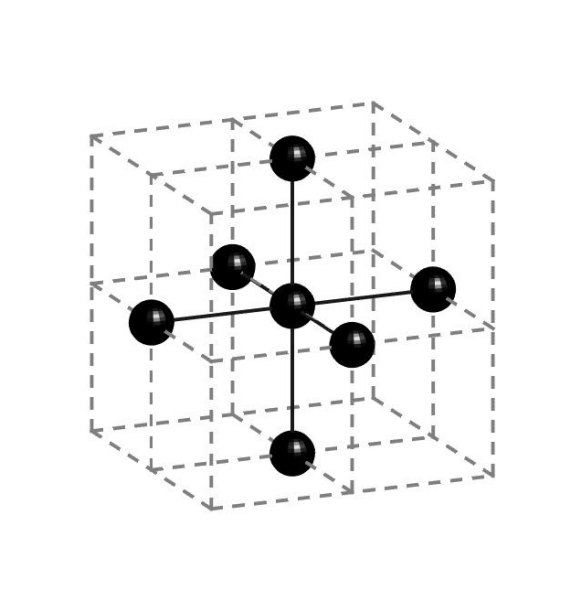
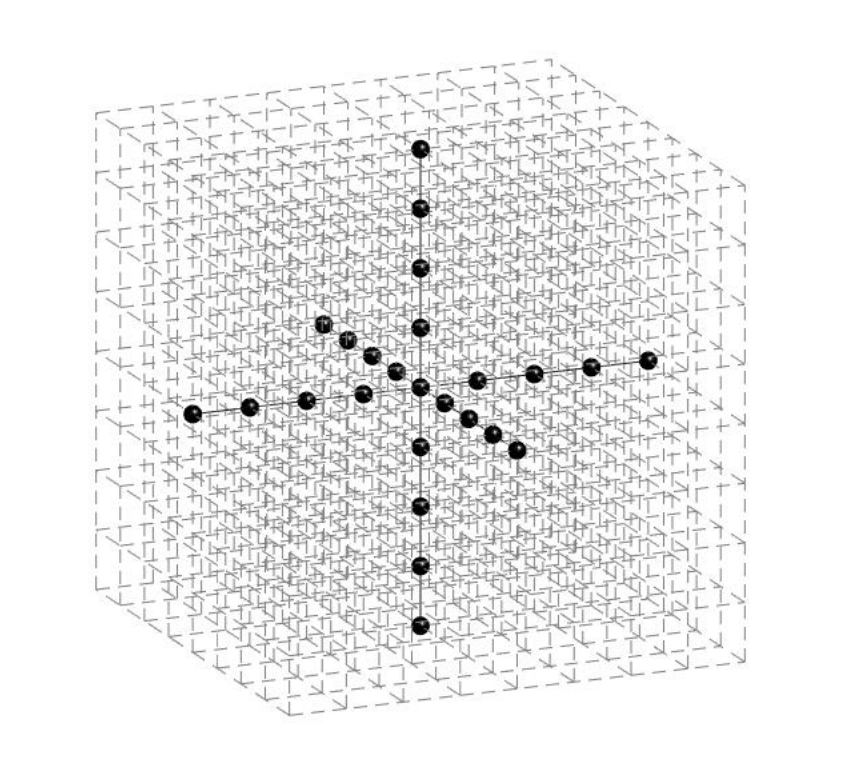
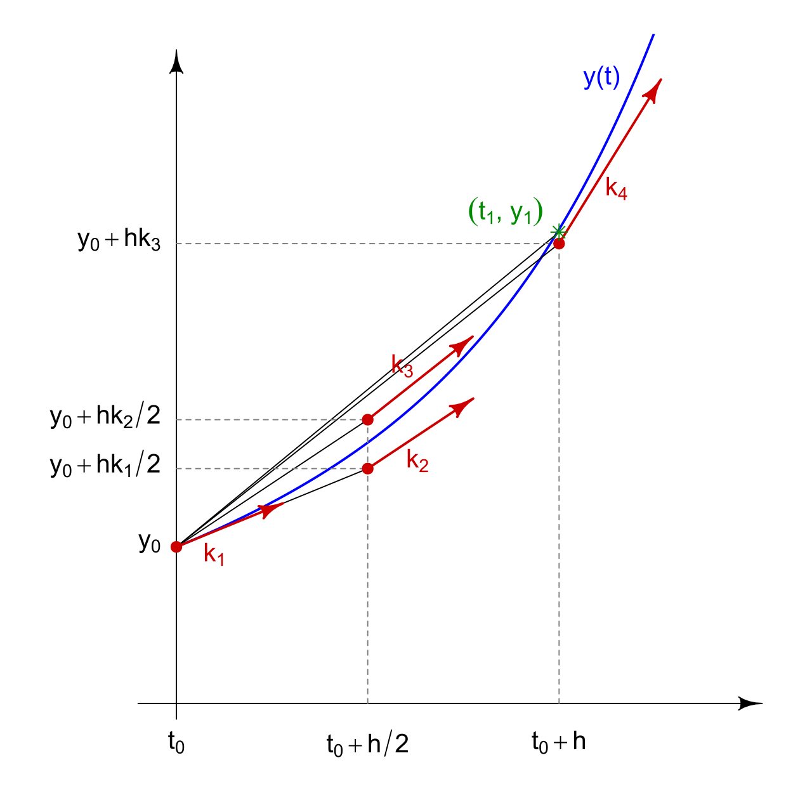

# 3D 热方程 – RK4 基准测试

本问题要求你复现并加速一个求解器，该求解器将**高阶有限差分拉普拉斯算子**与**RK4 时间积分**相结合，用于求解 3D 热方程。你需要从 **`reference.py`** 开始，这是一个纯 PyTorch 实现，我们将对比你的内核与其性能和正确性。本 README 重点阐述了数学原理、数据布局和数值折中，以便你能够构建一个加速且精确的 GPU 内核。

这是一个**科学计算基准测试**，让你接触高性能科学计算、内存访问优化和时间步进方案。

---

## 背景

我们求解 **3D 热方程**
$$
\frac{\partial u}{\partial t} = \alpha \nabla^2 u,
$$
在均匀笛卡尔网格上，其中：

- $u = u(t,x,y,z)$ 是温度（或任何标量场）
- $\alpha$ 是常数扩散系数
- $\nabla^2 u = \frac{\partial^2 u}{\partial x^2} + \frac{\partial^2 u}{\partial y^2} + \frac{\partial^2 u}{\partial z^2}$ 是**拉普拉斯算子**，用于衡量某点温度与其相邻点的差异程度
- 离散场的形状为 $(N_x, N_y, N_z)$，间距为 $(h_x, h_y, h_z)$

初始场 $u_0$ 以 PyTorch 张量形式提供，求解器通过由 CFL 类准则确定的 $\Delta t$ 大小的 `n_steps` 个 RK4 步长推进该场。

---

## 空间离散化

求解器使用**有限差分法**来近似拉普拉斯算子 $\nabla^2 u$。我们不是解析求解拉普拉斯算子，而是使用**模板**（stencil）来近似每个二阶导数——模板是一种模式，它访问相邻网格点，乘以系数，然后求和。

对于此问题，我们使用 **8 阶精度** 模板来计算 **3D** 中的 **2 阶导数**。这意味着我们在每个方向上访问 4 个邻居（加上中心点），总共得到 25 个点的模板（1 个中心 + 4 个邻居 × 6 个方向 = 25 个点）。

<table>
<tr>
<td width="50%">

<em>2 阶 3D 模板：7 个点</em>

</td>
<td width="50%">

<em>8 阶 3D 模板：25 个点</em>

</td>
</tr>
</table>

<em> 来源：<a href="https://www.ness.music.ed.ac.uk/wp-content/uploads/2016/12/ICA2016-0561.pdf">ICA2016-0561.pdf</a></em>

> **问题说明：** 此内核实现了一个 **8 阶精度** 有限差分近似，用于计算 **3D** 中的 **2 阶导数**。

完整的拉普拉斯算子为 $\nabla^2 u = \frac{\partial^2 u}{\partial x^2} + \frac{\partial^2 u}{\partial y^2} + \frac{\partial^2 u}{\partial z^2}$，需要访问 **总共 25 个点**（中心点加上 6 个方向：±x、±y、±z 上各 4 个邻居）。如上图右侧面板所示。

系数来自标准半径 4 的 8 阶中心有限差分近似（[Fornberg 1988 表 1](https://doi.org/10.1090/S0025-5718-1988-0935077-0)）。记法 $C_n$ 表示距离中心 $n$ 的点的系数：$C_0$ 是中心点，$C_1$ 是距离为 ±1 的邻居，$C_2$ 是距离为 ±2 的邻居，依此类推。

| 系数 | 值              |
|------|-----------------|
| $C_0$ | $-205 / 72$     |
| $C_1$ | $+8 / 5$        |
| $C_2$ | $-1 / 5$        |
| $C_3$ | $+8 / 315$      |
| $C_4$ | $-1 / 560$      |

> **注意：边界处理**
> 
> 在任何维度上距离边界 4 个单元以内的点（即索引 `< 4` 或 `>= N-4`）在时间推进过程中**不会更新**。这些边界区域被视为固定的狄利克雷边界条件——它们的值直接从输入复制并保持不变。

---

## 时间积分 – 经典 RK4

为了将解从时间 $t$ 推进到 $t + \Delta t$，我们需要对热方程进行积分。由于我们已经离散化了空间（使用有限差分法处理拉普拉斯算子），现在得到的是一个关于时间的常微分方程：在每个网格点，温度根据 $\frac{du}{dt} = \alpha \nabla^2 u$ 变化。为了数值求解，我们使用**经典的四阶龙格-库塔方法（RK4）**，它在每个时间步内计算四个不同中间状态下的拉普拉斯算子，以实现高精度。

### 理解 RK4

RK4 是一种通过在每个时间步内评估四个不同“阶段”来求解常微分方程的方法，从而获得下一时间步解的高精度估计。

下图展示了 RK4 的工作原理。曲线表示真实解 $u(t)$ 随时间的变化。从点 $u_n$（最左边的点）开始，RK4 在时间步内的四个不同点处评估斜率（变化率）：

- **$k_1$**：区间**开始**处的斜率，通过计算当前状态 $u_n$ 下的拉普拉斯算子得到（这是欧拉方法会使用的）
- **$k_2$**：区间**中点**处的斜率，首先使用 $k_1$ 向前走半步以创建一个中间阶段，然后计算该阶段的拉普拉斯算子
- **$k_3$**：同样是**中点**处的斜率，但这次使用 $k_2$（而非 $k_1$）向前走半步以创建一个更精确的中间阶段，然后计算该阶段的拉普拉斯算子
- **$k_4$**：区间**终点**处的斜率，使用 $k_3$ 向前走整步以创建一个最终阶段，然后计算该终点的拉普拉斯算子

注意，$k_2$ 和 $k_3$ 都估计中点处的斜率，但 $k_3$ 使用了更精确的估计 $k_2$ 来达到中点，因此更准确。通过在起点、中点（使用两次不同的估计）和终点采样斜率，并以权重（1、2、2、1）组合它们，RK4 实现了比欧拉方法（仅使用 $k_1$）高得多的精度。

*RK4 使用的四个斜率估计 $k_1$ 到 $k_4$，展示了它们如何在时间步内的不同点对解进行采样。图片由 [HilberTraum](https://commons.wikimedia.org/wiki/User:HilberTraum)（CC BY-SA 4.0）提供，来自 [维基百科](https://en.wikipedia.org/wiki/Runge%E2%80%93Kutta_methods)。*

### RK4 算法

对于每个时间步，RK4 计算四个斜率估计并将其组合：

1. $k_1 = \alpha \, \nabla^2(u_n)$
2. $k_2 = \alpha \, \nabla^2(u_n + \tfrac{\Delta t}{2} k_1)$
3. $k_3 = \alpha \, \nabla^2(u_n + \tfrac{\Delta t}{2} k_2)$
4. $k_4 = \alpha \, \nabla^2(u_n + \Delta t \, k_3)$

然后使用加权平均更新解：

$$u_{n+1} = u_n + \frac{\Delta t}{6}\left(k_1 + 2k_2 + 2k_3 + k_4\right)$$

权重（1, 2, 2, 1）使 RK4 具有**4 阶精度**——误差与 $O(\Delta t^4)$ 成正比。

---

## 性能基线

参考实现（`reference.py`）使用 PyTorch 进行优化。你的 CUDA 内核应旨在超越的主要基准测试时间：

| 网格大小 | 时间步数 | PyTorch 基线 (ms) | 朴素 Triton (ms) | 朴素 CUDA (ms) |
|----------|----------|-------------------|------------------|----------------|
| 600      | 10       | 1458 ± 3          | 317 ± 3          | 148 ± 1        |

你的 CUDA 内核应通过自定义内存访问模式、共享内存优化和内核融合，在此 PyTorch 基线上实现显著加速。朴素 CUDA 和 Triton 实现提供了直接转换所能达到的基线。

**关于精度要求的说明：** 测试框架检查最终场与参考值的吻合程度约为 1e-6（`rtol=1e-6`，`atol=1e-6`），因此你的 CUDA 内核必须精确复现此结果。